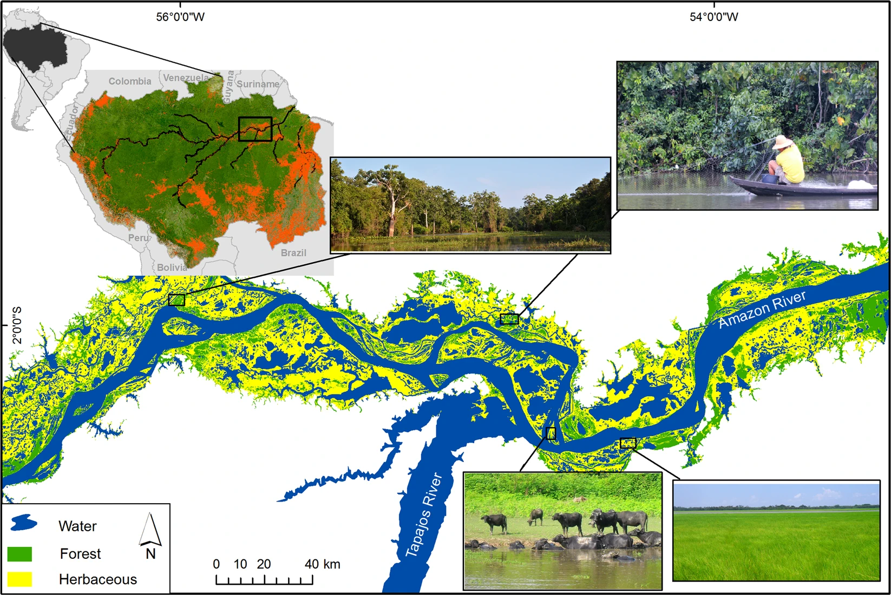
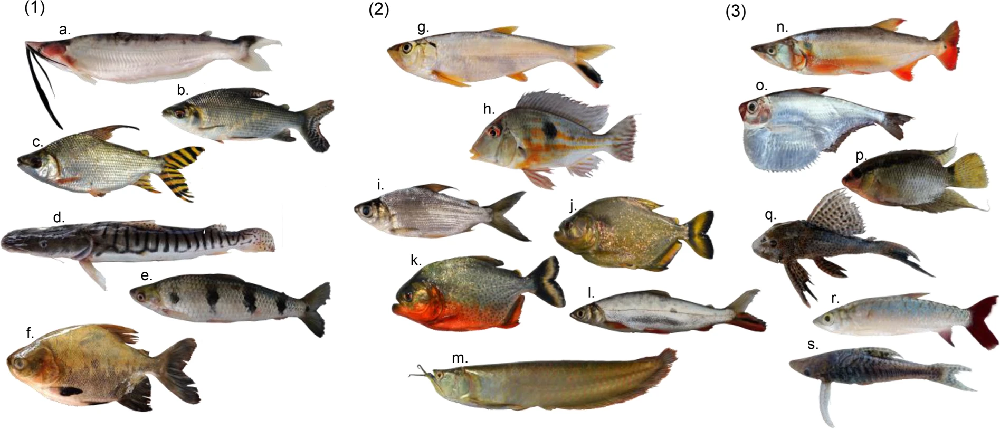

```{r setup, include=FALSE}
# Configuración global para todos los chunks de código
knitr::opts_chunk$set(
  echo = TRUE,        # Muestra el código en el documento
  warning = FALSE,    # Oculta advertencias
  message = FALSE,    # Oculta mensajes
  fig.width = 7,      # Ancho de las figuras
  fig.height = 5,     # Altura de las figuras
  fig.align = 'center', # Alinea las figuras al centro
  tidy = TRUE         # Limpia y ordena el código de los chunks
)
```

```{r instalaciones no se ejecuta, echo=FALSE, eval=FALSE}
install.packages("tidyverse")
install.packages("broom")
```


```{r librerias, include=FALSE}
library(tidyverse)    # Carga las bibliotecas necesarias
library(broom)
```

```{r dataset, include=FALSE}
# Cargar el conjunto de datos
fish_data <- read.csv("bases/fish.csv", encoding = "ISO-8859-1")
```


# Introducción

La hibridación in situ con fluorescencia (FISH) es una técnica poderosa utilizada para detectar y localizar la presencia o ausencia de secuencias de ADN específicas en los cromosomas. Este estudio tiene como objetivo investigar la organización espacial de la expresión génica y la arquitectura nuclear, centrándose en la región Meg3/Gtl2 en diferentes líneas celulares [@begossi2018fish].

# Materiales y Métodos

## Área de Estudio

Este estudio involucra el análisis de varias líneas celulares, cada una representando diferentes antecedentes genéticos, incluidas líneas knockout (KO) y controles de tipo salvaje. Los datos fueron recolectados utilizando FISH, dirigido a loci específicos dentro del espacio nuclear. Encuentra el [paper aquí](https://www.nature.com/articles/s41598-019-52243-0)

## Colecta de Datos

El conjunto de datos incluye mediciones de @junk2007freshwater:
- Distancias absolutas de señales FISH dentro del núcleo.
- Estados de expresión del gen Meg3/Gtl2.
- Volumen nuclear y posición relativa del centrómero.

```{r, echo=FALSE, eval=TRUE}
#| label: fig-Figura1
#| out-width: "80%"
#| fig-cap: "Study area in the lower Amazon floodplain showing land cover during the low-water period. Land-cover types are forest, herbaceous vegetation, and open water (lakes and secondary channels). In the lower Amazon region, vegetation consists primarily of herbaceous or shrub vegetation with only 13% forest cover51. Top left maps show the location of the Amazon Basin in South America (shaded black). Deforested areas within the basin are shaded in red50,51,75 and the study reach is enclosed in the rectangle. Photos (by L. Fernandes and C. C. Arantes): (a) forest surrounding a floodplain lake, (b) gillnet being set up for fish sampling, (c) water buffalo raised by local farmers, (d) floodplain area covered by herbaceous vegetation. Figure created in ArcGIS Desktop 10.6 http://desktop.arcgis.com/en/."


```


## Análisis Estadístico

El análisis estadístico se llevará a cabo utilizando `tidyverse`de R para la visualización de datos. Se utilizará un Modelo Lineal Generalizado (GLM) para analizar la relación entre los estados de expresión, el volumen nuclear y otros factores espaciales, según @arantes2019floodplain.

```{r}
# Limpieza y preparación de datos
# Eliminando filas de metadatos y columnas innecesarias
fish_data_clean <- fish_data %>% 
  select(-c(Legend., X, X.1)) %>% 
  filter(!is.na(expr))

# Convertir variables relevantes a factores
fish_data_clean <- fish_data_clean %>%
  mutate(
    expr = factor(expr),
    repKO = factor(repKO),
    rep = factor(rep),
    cell = factor(cell)
  )

# Resumen de datos
summary(fish_data_clean)

# Visualización del volumen nuclear por estado de expresión
bxplot <- ggplot(fish_data_clean, aes(x = expr, y = size)) +
  geom_boxplot() +
  labs(title = "Volumen Nuclear por Estado de Expresión",
       x = "Estado de Expresión",
       y = "Volumen Nuclear (µm^3)") +
  theme_minimal()

bxplot

# Análisis GLM
glm_model <- glm(expr ~ size + dist + relcen + repKO, data = fish_data_clean, family = binomial)
summary(glm_model)

```

```{r exportar plots, include=FALSE}
ggsave(filename = "exports/plots/boxplot fish.png", plot = bxplot,
       width = 16, height = 14, units = "cm", dpi = 600, bg = "white")
```


```{r exportar tabla, include=FALSE}
broom::tidy(glm_model) %>% openxlsx::write.xlsx("Exports/Resultados Modelo.xlsx")
```

# Resultados

El análisis reveló asociaciones significativas entre el volumen nuclear, el estado de expresión y otros parámetros espaciales. El modelo GLM sugiere que el tamaño y la distancia de las señales FISH son predictivos de los estados de expresión génica.

```{r, echo=FALSE, eval=TRUE}
#| label: fig-Figura2
#| out-width: "80%"
#| fig-cap: "Examples of species possessing relatively high (1), medium (2), and low (3) importance for local fisheries (see Table S1). (1) (a) Hypophthalmus fimbriatus, (b) Prochilodus nigricans, (c) Semaprochilodus insignis, (d) Pseudoplatystoma tigrinum, (e) Schizodon fasciatus, (f) Colossoma macropomum; (2) (g) Pellona castelnaeana, (h) Geophagus proximus, (i) Curimata inornata,(j) Serrasalmus maculatus, (k) Pygocentrus nattereri, (l) Hemiodus microlepis, (m) Osteoglossum bicirrhosum; (3) (n) Acestrorhynchus abbreviatus, (o) Pristigaster cayana, (p) Mesonauta insignis, (q) Hypostomus plecostomus, (r) Chalceus epakros, (s) Hypoptopoma gulare. Photos: C. C. Arantes, K. O. Winemiller, J. A. de Oliveira."

```


# Discusión
Este estudio demuestra la importancia de la arquitectura nuclear en la regulación génica. La organización espacial dentro del núcleo juega un papel crítico en la determinación del estado de expresión de genes clave como Meg3/Gtl2.

## Conclusión
Este estudio resalta cómo la arquitectura nuclear influye en la expresión génica, proporcionando una visión detallada de la regulación espacial dentro del núcleo.
